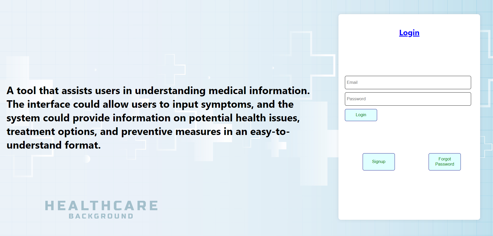

# This is a healthcare project.It is a MERN stack project. It uses Mistral LLM model.

### For running this project

# Backend
- Make a MongoDB account and get your MongoDB URI
- Install all the required modules using 'npm install'
- Then enter 'npm run start'
- Now your server is running on your localhost 3000

# Frontend
- Install all the required modules using 'npm install'
- Make sure you have a Mistral LLM Model Api key
- Now for running the frontend enter 'npm start'
